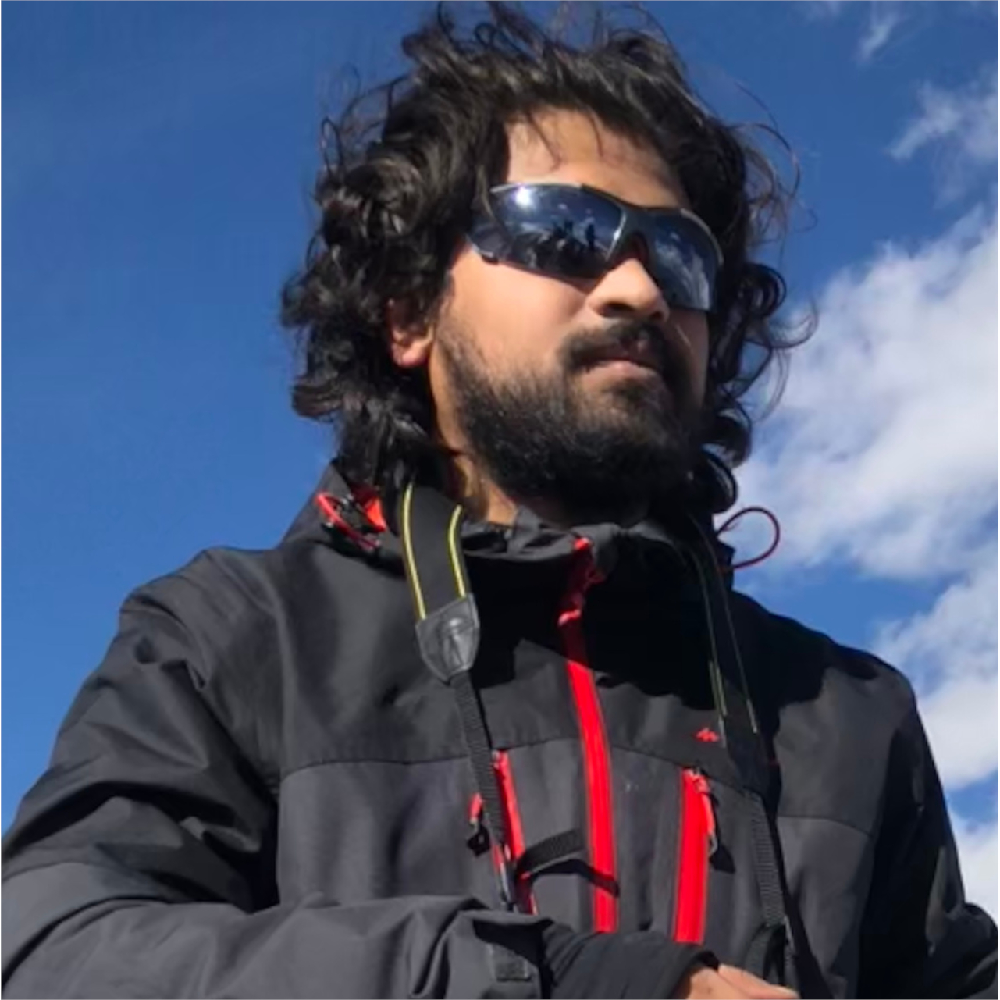

<main>
       <section class="hello-world">
            <h2>"All Programmers begin their journey by saying hello to the world, I welcome you too"
                

                    Hello
                    Namaste
                    Marhaba
                    Bonjour
                    Kon'nichiwa
                    Ciao
                    Salve
                

            </h2>
        </section>
        <section class="about-me" id="about-me">
            

                
Greetings, Visitor!
 
                
I'm Spandan, my friends call me Span.
 
                
I am a full stack developer with a slight lean towards Front-end Development and UX/UI Design.
 
                
I believe application development brings a developer closer to the user, this and my drive to study design and psychology drove me towards a career change and take up Full Stack Development.  <em>Read my <a href="/career/2019/05/10/My-Career-Change.html">Blog</a> for more info</em>
 
                
Contact me via email <a href="mailto:spandan.naik@gmail.com"></a> , if you are looking for a web presence or looking for a staff web-developer.

            

            

                
            

        </section>        
</main>
